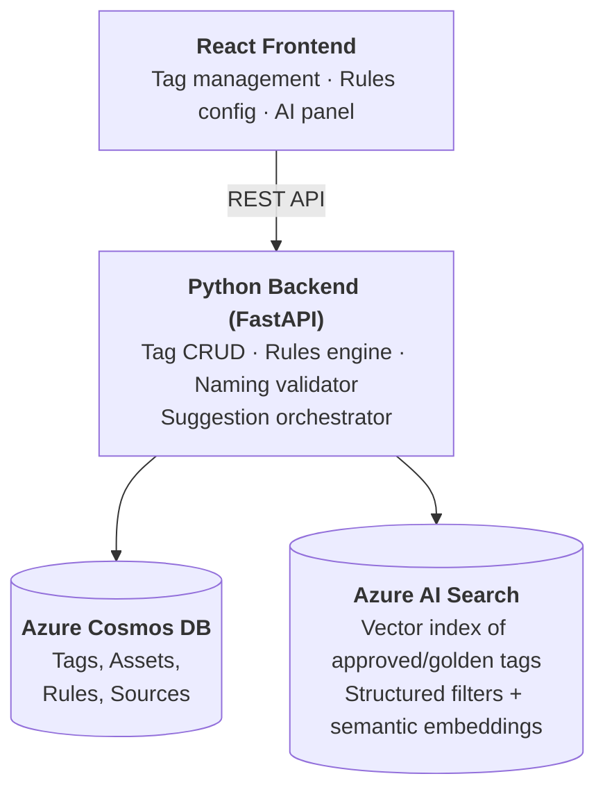

# OT Tag Registry

**One place to create, govern, and standardise every sensor tag across your industrial sites.**

---

## The Problem

In most industrial operations, tag definitions — the names, rules, and metadata that describe every sensor, actuator, and data point — live in **Excel sheets, email threads, and tribal knowledge**. This leads to:

- **Inconsistent naming** — the same measurement is called different things at different sites, breaking analytics and cross-site benchmarking.
- **Unclear ownership** — nobody knows whether OT, IT, or the system integrator is responsible for a given tag definition.
- **Slow onboarding** — adding a new sensor or production line means weeks of rework aligning naming conventions, validation rules, and data contracts.

## What This App Does

The OT Tag Registry gives **Site OT engineers** a single, governed application to:

| Capability | Business Value |
|---|---|
| **Create / update / retire tags** | Every tag has a single source of truth with full lifecycle tracking |
| **Define physical-truth rules as configuration** | L1 range checks (min/max, spike, missing-data) and L2 state profiles (Running/Idle/Stop) are set by engineers — no code changes needed |
| **Enforce consistent naming automatically** | A deterministic validator ensures every tag follows the site naming schema — no more "creative" tag names |
| **Get AI-powered name suggestions** | When creating a tag, the system suggests canonical names based on what already exists for that site/line/equipment — aligning new tags with established standards instantly |
| **Request validation & approval** | Governance workflows ensure changes are reviewed before going live |

## How AI Adds Value (Without Replacing Governance)

The **"Suggest a Name"** feature uses **Azure AI Search** to recommend tag names based on semantic similarity to approved tags — filtered by the correct site, line, and equipment context. This means:

- A new engineer typing *"outlet pressure sensor on main pump"* instantly sees the canonical name used across the organisation.
- Descriptions in different languages or wordings still map to the right standard name.
- **AI assists; rules enforce.** Suggestions are always optional — the deterministic naming validator remains the final gate.

> **Rules for correctness. AI for speed and consistency.**

## Key Data Objects

| Object | Purpose |
|---|---|
| **Asset** | Organisational hierarchy — site → line → equipment |
| **Tag** | The core entity — name, description, unit, datatype, sampling frequency, criticality |
| **Source** | Where the data comes from — PLC, SCADA, Historian, connector, topic/path |
| **L1 Rules (Range)** | Physical boundary checks — min/max, missing-data policy, spike threshold |
| **L2 Rules (State Profile)** | Operational state mapping — Running/Idle/Stop with state-dependent ranges |

## Architecture



- **Frontend + Backend run locally** for fast iteration and demo reliability.
- **Azure managed services** provide enterprise-grade persistence and AI search capabilities.

## Getting Started

### Prerequisites

- **Python 3.12+** with [`uv`](https://docs.astral.sh/uv/) package manager
- **Node.js 20+** with npm
- **Azure Cosmos DB** account — the backend persists all data to a real Cosmos DB instance in your Azure subscription

### Environment Setup

Copy the example env file and fill in your Cosmos DB credentials:

```bash
cp server/.env.example server/.env
```

Required variables:

| Variable | Description |
|---|---|
| `COSMOS_ENDPOINT` | Your Cosmos DB account URI (e.g. `https://<account>.documents.azure.com:443/`) |
| `COSMOS_KEY` | Primary or secondary key from the Azure portal |
| `COSMOS_DATABASE` | Database name (defaults to `ot-tag-registry`) |

### Install & Run

```bash
# Install dependencies
cd server && uv venv && uv pip install -r requirements.txt
cd ../services && uv venv && uv pip install -r requirements.txt
cd ../client && npm install

# Start backend (port 8000)
cd server && uv run uvicorn src.main:app --reload

# Start frontend (port 5173)
cd client && npm run dev
```

### Seed Sample Data

The seed script populates your Cosmos DB with realistic sample data for development and demo purposes:

```bash
cd services && uv run python -m database.seed
```

This will:

1. **Create the database and 5 containers** (`assets`, `tags`, `sources`, `l1Rules`, `l2Rules`) if they don't already exist
2. **Upsert sample documents** — 12 assets across 3 sites (Munich, Detroit, Shanghai), 6 data sources, 31 tags, 27 L1 rules, and 5 L2 rules

> **⚠️ This writes to your live Azure Cosmos DB instance.** The script uses upsert operations, so it's safe to re-run — it will overwrite existing seed documents rather than create duplicates. Make sure your `server/.env` has valid credentials before running.

## Project Structure

```
ot-tag-registry/
├── client/          # React + Vite + TypeScript frontend
├── server/          # Python (FastAPI) backend API (standalone deployable)
└── services/        # Local-only setup tools (not deployed)
    ├── database/    # Cosmos DB container creation + data seeding
    ├── search/      # Azure AI Search (vector index)
    └── language/    # Language normalisation (optional)
```

## Roadmap

See [build-issues.md](./build-issues.md) for the full technical issue backlog.