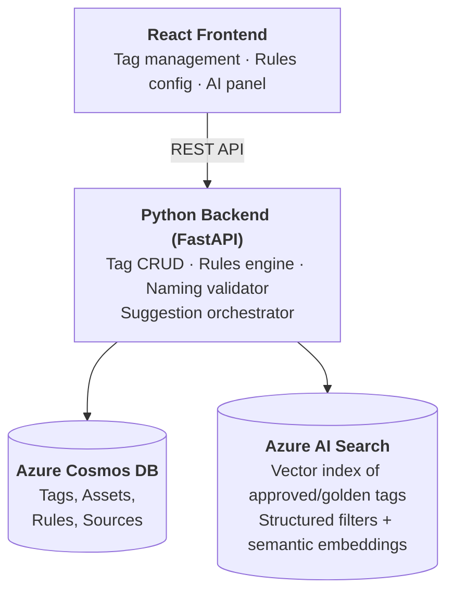

# OT Tag Registry

**One place to create, govern, and standardise every sensor tag across your industrial sites.**

## The Problem

In most industrial operations, tag definitions — the names, rules, and metadata that describe every sensor, actuator, and data point — live in **Excel sheets, email threads, and tribal knowledge**. This leads to:

- **Inconsistent naming** — the same measurement is called different things at different sites, breaking analytics and cross-site benchmarking.
- **Unclear ownership** — nobody knows whether OT, IT, or the system integrator is responsible for a given tag definition.
- **Slow onboarding** — adding a new sensor or production line means weeks of rework aligning naming conventions, validation rules, and data contracts.

## What This App Does

The OT Tag Registry gives **Site OT engineers** a single, governed application to:

| Capability                                       | Business Value                                                                                                                                                              |
| ------------------------------------------------ | --------------------------------------------------------------------------------------------------------------------------------------------------------------------------- |
| **Create / update / retire tags**                | Every tag has a single source of truth with full lifecycle tracking                                                                                                         |
| **Define physical-truth rules as configuration** | L1 range checks (min/max, spike, missing-data) and L2 state profiles (Running/Idle/Stop) are set by engineers — no code changes needed                                      |
| **Enforce consistent naming automatically**      | A deterministic validator ensures every tag follows the site naming schema — no more "creative" tag names                                                                   |
| **Get AI-powered name suggestions**              | When creating a tag, the system suggests canonical names based on what already exists for that site/line/equipment — aligning new tags with established standards instantly |
| **Request validation & approval**                | Governance workflows ensure changes are reviewed before going live                                                                                                          |

## How AI Adds Value (Without Replacing Governance)

The **"Suggest a Name"** feature uses **Azure AI Search** to recommend tag names based on semantic similarity to approved tags — filtered by the correct site, line, and equipment context. This means:

- A new engineer typing _"outlet pressure sensor on main pump"_ instantly sees the canonical name used across the organisation.
- Descriptions in different languages or wordings still map to the right standard name.
- **AI assists; rules enforce.** Suggestions are always optional — the deterministic naming validator remains the final gate.

> **Rules for correctness. AI for speed and consistency.**

## Key Data Objects

| Object                       | Purpose                                                                              |
| ---------------------------- | ------------------------------------------------------------------------------------ |
| **Asset**                    | Organisational hierarchy — site → line → equipment                                   |
| **Tag**                      | The core entity — name, description, unit, datatype, sampling frequency, criticality |
| **Source**                   | Where the data comes from — PLC, SCADA, Historian, connector, topic/path             |
| **L1 Rules (Range)**         | Physical boundary checks — min/max, missing-data policy, spike threshold             |
| **L2 Rules (State Profile)** | Operational state mapping — Running/Idle/Stop with state-dependent ranges            |

## Architecture



- **Frontend + Backend run locally** for fast iteration and demo reliability.
- **Azure managed services** provide enterprise-grade persistence and AI search capabilities.

## Getting Started

### Prerequisites

- [Python 3.12+](https://www.python.org/) with [`uv`](https://docs.astral.sh/uv/)
- [Node.js 20+](https://nodejs.org/) with npm
- [Azure CLI (`az`)](https://learn.microsoft.com/en-us/cli/azure/install-azure-cli) — logged in
- [Azure Developer CLI (`azd`)](https://learn.microsoft.com/en-us/azure/developer/azure-developer-cli/install-azd)

### Setup

```bash
./setup.sh
```

This will:
1. Install backend and frontend dependencies
2. Provision Azure resources via `azd up` (Cosmos DB, AI Search, AI Foundry) — skips if already provisioned
3. Print commands to start the dev servers

To start the servers immediately after setup:

```bash
./setup.sh --start both      # backend (port 8000) + frontend (port 5173)
./setup.sh --start server    # backend only
./setup.sh --start client    # frontend only
```

## API Reference

All endpoints are prefixed with `/api`.

### Tags

| Method  | Path                              | Description                                             |
| ------- | --------------------------------- | ------------------------------------------------------- |
| `GET`   | `/api/tags`                       | List tags (query params: `status`, `assetId`, `search`) |
| `GET`   | `/api/tags/{id}`                  | Get a single tag                                        |
| `POST`  | `/api/tags`                       | Create a new tag (defaults to `draft` status)           |
| `PUT`   | `/api/tags/{id}`                  | Partial update — only provided fields change            |
| `PATCH` | `/api/tags/{id}/retire`           | Soft-delete (sets status to `retired`)                  |
| `POST`  | `/api/tags/validate-name`         | Validate a name against the naming schema               |
| `POST`  | `/api/tags/suggest-name`          | AI-powered name suggestions via hybrid vector search    |
| `POST`  | `/api/tags/{id}/request-approval` | Submit tag for governance approval                      |
| `POST`  | `/api/tags/{id}/approve`          | Approve a pending tag                                   |
| `POST`  | `/api/tags/{id}/reject`           | Reject a pending tag (optional reason)                  |

### Assets

| Method | Path          | Description        |
| ------ | ------------- | ------------------ |
| `GET`  | `/api/assets` | List all assets    |
| `POST` | `/api/assets` | Create a new asset |

### Sources

| Method | Path           | Description         |
| ------ | -------------- | ------------------- |
| `GET`  | `/api/sources` | List all sources    |
| `POST` | `/api/sources` | Create a new source |

### Rules

| Method   | Path                      | Description                 |
| -------- | ------------------------- | --------------------------- |
| `GET`    | `/api/tags/{id}/rules/l1` | Get L1 (range) rule         |
| `POST`   | `/api/tags/{id}/rules/l1` | Create or replace L1 rule   |
| `PUT`    | `/api/tags/{id}/rules/l1` | Partial update L1 rule      |
| `DELETE` | `/api/tags/{id}/rules/l1` | Delete L1 rule              |
| `GET`    | `/api/tags/{id}/rules/l2` | Get L2 (state profile) rule |
| `POST`   | `/api/tags/{id}/rules/l2` | Create or replace L2 rule   |
| `PUT`    | `/api/tags/{id}/rules/l2` | Partial update L2 rule      |
| `DELETE` | `/api/tags/{id}/rules/l2` | Delete L2 rule              |

## Testing & Linting

```bash
cd server && uv run pytest tests/ -v   # Backend tests
cd client && npm run lint               # Frontend lint
cd client && npm run build              # Frontend type-check + build
```

## Deployment

Infrastructure is defined as **Bicep** templates in `azure/`. The setup script runs `azd up` automatically, but you can also run it manually:

```bash
azd up        # Provision infrastructure + deploy
azd deploy    # Deploy code changes only
```

## Project Structure

```
ot-tag-registry/
├── azure/           # Bicep infrastructure-as-code templates
├── client/          # React + Vite + TypeScript frontend
├── server/          # Python (FastAPI) backend API (standalone deployable)
│   ├── src/
│   │   ├── routes/      # API endpoints (tags, assets, sources, rules, suggest-name)
│   │   ├── models/      # Pydantic data models
│   │   ├── utils/       # Cosmos DB client (db.py) + AI Search client (search.py)
│   │   └── validators/  # Naming schema validator
│   └── tests/           # Pytest suite with mocked Cosmos repos
├── services/        # Local-only setup tools (not deployed)
│   ├── database/    # Cosmos DB container creation + data seeding
│   ├── search/      # Azure AI Search index creation + golden tag seeding
│   └── language/    # Language normalisation
├── skills/          # Copilot agent skill definitions
└── excalidraw/      # Architecture diagrams
```

## Disclaimer

> [!WARNING]
> This repository is provided for **demo, educational, and experimental purposes only**.
> It is **not production‑ready** and **must not be used in production deployments**.
> The author takes **no responsibility or liability** for any damage, data loss, costs,
> or issues arising from the use of this code.
> Use at your own risk.
