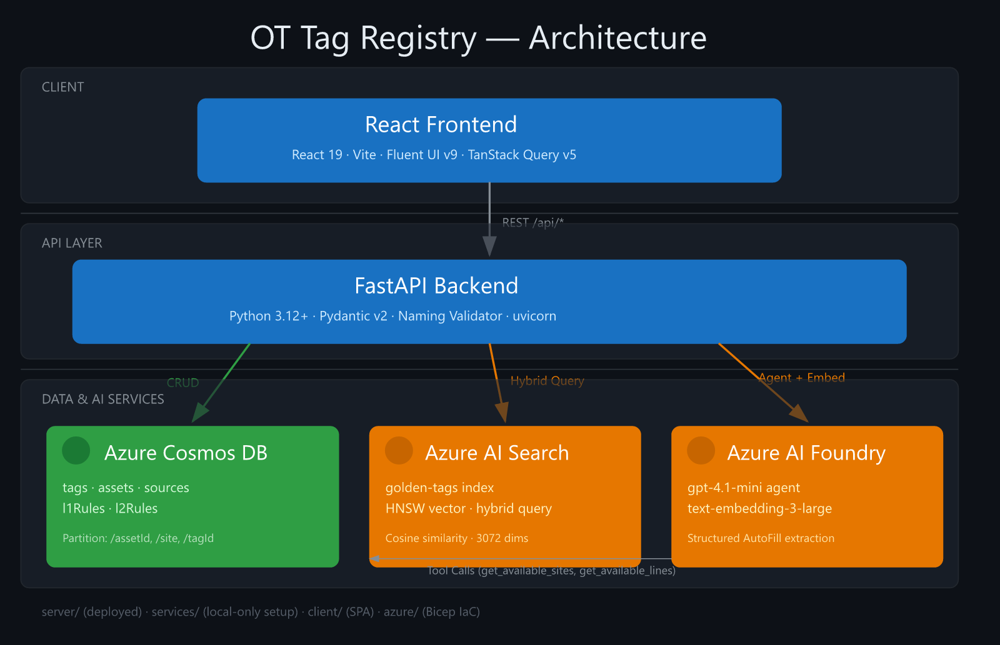

# OT Tag Registry — Technical Reference

> **One place to create, govern, and standardise every sensor tag across your industrial sites.**
>
> This document is the developer-facing companion to [README.md](./README.md). It covers architecture internals, data models, AI pipeline details, and infrastructure.

## The Problem

In most industrial operations, tag definitions — the names, rules, and metadata that describe every sensor, actuator, and data point — live in **Excel sheets, email threads, and tribal knowledge**. This leads to:

- **Inconsistent naming** — the same measurement is called different things at different sites, breaking analytics and cross-site benchmarking.
- **Unclear ownership** — nobody knows whether OT, IT, or the system integrator is responsible for a given tag definition.
- **Slow onboarding** — adding a new sensor or production line means weeks of rework aligning naming conventions, validation rules, and data contracts.

## What This App Does

The OT Tag Registry gives **Site OT engineers** a single, governed application to:

| Capability                                       | Business Value                                                                                                                                                              |
| ------------------------------------------------ | --------------------------------------------------------------------------------------------------------------------------------------------------------------------------- |
| **Create / update / retire tags**                | Every tag has a single source of truth with full lifecycle tracking                                                                                                         |
| **Define physical-truth rules as configuration** | L1 range checks (min/max, spike, missing-data) and L2 state profiles (Running/Idle/Stop) are set by engineers — no code changes needed                                      |
| **Enforce consistent naming automatically**      | A deterministic validator ensures every tag follows the site naming schema — no more "creative" tag names                                                                   |
| **Get AI-powered name suggestions**              | When creating a tag, the system suggests canonical names based on what already exists for that site/line/equipment — aligning new tags with established standards instantly |
| **Request validation & approval**                | Governance workflows ensure changes are reviewed before going live                                                                                                          |

## Architecture



> *Source: [`excalidraw/diagrams/architecture.excalidraw`](excalidraw/diagrams/architecture.excalidraw) — open in [Excalidraw](https://excalidraw.com) to edit interactively.*

### Component Overview

| Layer | Component | Tech Stack | Responsibility |
|-------|-----------|------------|----------------|
| **Client** | React Frontend | React 19, Vite, Fluent UI v9, TanStack Query v5, TypeScript | Tag management UI, rules configuration, AI auto-fill panel |
| **API** | FastAPI Backend | Python 3.12+, FastAPI, Pydantic v2, `uvicorn` | Tag CRUD, naming validation, rules engine, auto-fill orchestration |
| **Data** | Azure Cosmos DB | NoSQL (Core/SQL API), 5 containers | Persistent storage for tags, assets, sources, and rules |
| **AI** | Azure AI Search | Hybrid search (keyword + vector), HNSW index | Golden-tag index for semantic name suggestions |
| **AI** | Azure AI Foundry | gpt-4.1-mini agent, text-embedding-3-large | Structured field extraction from search results |
| **IaC** | Bicep templates | Subscription-scoped, modular | Cosmos DB, AI Search, AI Foundry, RBAC role assignments |

### Data Flow

```
Frontend ──REST /api/*──▶ FastAPI Backend ──CRUD──▶ Cosmos DB
                                │
                                ├──embed (text-embedding-3-large)──▶ AI Foundry
                                ├──hybrid query──────▶ AI Search (golden-tags)
                                └──agent extract─────▶ AI Foundry (gpt-4.1-mini)
                                                      │ ↳ tool calls (get_available_sites,
                                                      │   get_available_lines) ──▶ Cosmos DB
                                                      ▼
                                            Structured AutoFillResult
```

### Server vs. Services Separation

| Directory | Deployed? | Purpose |
|-----------|-----------|---------|
| `server/` | ✅ Yes | **Standalone deployable API.** Contains only runtime logic: routes, models, validators, DB/search clients. Never imports from `services/`. |
| `services/` | ❌ No | **Local-only development tools.** Cosmos DB container creation, data seeding, AI Search index creation/seeding, language normalisation. Has its own `requirements.txt` and venv. |

## Tech Stack

### Backend

| Dependency | Version | Purpose |
|-----------|---------|---------|
| Python | 3.12+ | Runtime |
| FastAPI | latest | REST API framework |
| Pydantic | v2 | Data validation & serialisation (all models) |
| `uv` | latest | Package manager & script runner |
| `azure-cosmos` | latest | Cosmos DB SDK |
| `azure-search-documents` | latest | AI Search SDK |
| `azure-ai-projects` | latest | AI Foundry `AIProjectClient` for embeddings + agent |
| `azure-identity` | latest | `DefaultAzureCredential` for all Azure auth |
| `python-dotenv` | latest | `.env` file loading |
| `pytest` | latest | Test framework (mocked Cosmos repos) |

### Frontend

| Dependency | Version | Purpose |
|-----------|---------|---------|
| React | 19 | UI framework |
| Vite | latest | Dev server & bundler |
| TypeScript | latest | Type safety |
| `@fluentui/react-components` | v9 | Component library (Fluent UI v9 only — never v8) |
| `@fluentui/react-icons` | latest | Icon library (Regular weight default, Filled for active) |
| TanStack Query | v5 | Data fetching, caching, mutations |
| React Compiler | enabled | Babel plugin — automatic memoisation |

### Infrastructure

| Resource | Bicep Module | Purpose |
|----------|-------------|---------|
| Azure Cosmos DB | `modules/cosmosdb.bicep` | NoSQL database with 5 containers |
| Azure AI Search | `modules/ai-search.bicep` | Vector + keyword search service |
| Azure AI Foundry | `modules/ai-foundry.bicep` | AI project with chat + embedding deployments |
| RBAC Assignments | `modules/role-assignment.bicep` | Cognitive Services OpenAI User, Search Index Data Contributor, Search Service Contributor, Azure AI Developer |

## Data Models

All data models are Pydantic `BaseModel` classes in `server/src/models/`. IDs are UUID v4 strings. Timestamps are UTC `datetime`. Soft deletes via `status="retired"`.

### Tag

The core entity — a named data point from an industrial sensor.

```
Tag
├── id: str (UUID v4)
├── name: str (validated against naming schema)
├── description: str
├── unit: str (e.g., "bar", "°C", "RPM")
├── datatype: DataType (float | int | bool | string)
├── samplingFrequency: float (seconds)
├── criticality: Criticality (low | medium | high | critical)
├── status: TagStatus (draft | active | retired)
├── approvalStatus: ApprovalStatus (none | pending | approved | rejected)
├── rejectionReason: str | None
├── assetId: str (FK → Asset)
├── sourceId: str | None (FK → Source)
├── createdAt: datetime (UTC)
└── updatedAt: datetime (UTC)
```

### Asset

Organisational hierarchy: Site → Line → Equipment.

```
Asset
├── id: str (UUID v4)
├── site: str (e.g., "Plant-Luxembourg")
├── line: str (e.g., "Line-2")
├── equipment: str (e.g., "Pump-001")
├── hierarchy: str (computed: site.line.equipment)
├── description: str | None
├── createdAt: datetime (UTC)
└── updatedAt: datetime (UTC)
```

### Source

Where tag data originates — PLC, SCADA, Historian.

```
Source
├── id: str (UUID v4)
├── systemType: SystemType (PLC | SCADA | Historian | Other)
├── connectorType: str (e.g., "OPC-UA", "MQTT", "Modbus")
├── topicOrPath: str (address/topic for data source)
├── description: str | None
├── createdAt: datetime (UTC)
└── updatedAt: datetime (UTC)
```

### L1 Rule (Range Validation)

Physical boundary checks attached to a tag.

```
L1Rule
├── id: str (UUID v4)
├── tagId: str (FK → Tag)
├── min: float | None
├── max: float | None
├── missingDataPolicy: MissingDataPolicy (ignore | alert | interpolate | last-known)
├── spikeThreshold: float | None
├── createdAt: datetime (UTC)
└── updatedAt: datetime (UTC)
```

### L2 Rule (State Profile)

Operational state mapping — expected value ranges per equipment state.

```
L2Rule
├── id: str (UUID v4)
├── tagId: str (FK → Tag)
├── stateMapping: list[StateMapping]
│   ├── state: OperationalState (Running | Idle | Stop)
│   ├── conditionField: str (which signal determines state)
│   ├── conditionOperator: (> | >= | < | <= | == | != | between)
│   ├── conditionValue: float | [min, max]
│   ├── rangeMin: float | None
│   └── rangeMax: float | None
├── createdAt: datetime (UTC)
└── updatedAt: datetime (UTC)
```

## Cosmos DB Containers

| Container | Partition Key | Content | Access Pattern |
|-----------|--------------|---------|----------------|
| `assets` | `/site` | Equipment hierarchy (site → line → equipment) | Filter by site, then line |
| `tags` | `/assetId` | Tag definitions | All tags for a given asset |
| `sources` | `/systemType` | Data source configurations (PLC, SCADA, etc.) | Filter by system type |
| `l1Rules` | `/tagId` | Range validation rules (min/max, spike, missing-data) | One rule per tag |
| `l2Rules` | `/tagId` | Operational state profiles (Running/Idle/Stop) | One rule per tag |

## Tag Naming Schema

Format: `<SITE>.<LINE>.<EQUIPMENT>.<MEASUREMENT>.<UNIT>.<ID>`

| Segment | Pattern | Examples |
|---------|---------|---------|
| **SITE** | `^[A-Z][a-zA-Z0-9]*$` | `LUX`, `BEL`, `NED` |
| **LINE** | `^[A-Z][a-zA-Z0-9]*$` | `L1`, `L2`, `L3` |
| **EQUIPMENT** | `^[A-Z][a-zA-Z0-9]*$` | `PMP001`, `CMP003`, `MOT004` |
| **MEASUREMENT** | `^[A-Z][a-zA-Z0-9]*$` | `Pressure`, `Temperature`, `Speed` |
| **UNIT** | `^[A-Z][a-zA-Z0-9]*$` | `Bar`, `Cel`, `Rpm`, `Mms` |
| **ID** | `^[0-9]+$` | `1`, `2`, `3` |

Enforced by a **deterministic validator** (`server/src/validators/naming_validator.py`) loaded from `naming_config.json`. The validator returns structured errors per segment. Tag names must be **globally unique** — the API rejects duplicates on create/update.

**Examples:**
- `LUX.L1.PMP001.Pressure.Bar.1` — Pressure sensor on Pump 001, Line 1, Luxembourg
- `BEL.L2.MOT001.Speed.Rpm.1` — Speed sensor on Motor 001, Line 2, Brussels

## AI Auto-Fill Pipeline

The `POST /api/tags/auto-fill` endpoint accepts a `{ query: str }` body and returns structured tag fields derived from the golden-tag index.

### Pipeline Steps

1. **Embed query** — The user's description is embedded using `text-embedding-3-large` via `AIProjectClient.get_openai_client().embeddings.create()`.

2. **Hybrid search** — The embedding is sent to Azure AI Search as a `VectorizedQuery` (3072 dimensions, HNSW, cosine similarity) alongside the raw text for keyword matching. No OData filters — search runs unfiltered across the `golden-tags` index.

3. **Agent extraction** — The top matches + original query are sent to the `tag-auto-fill` Foundry Agent (gpt-4.1-mini with function-calling tools). The agent may invoke:
   - `get_available_sites` — queries Cosmos DB `assets` container for distinct sites
   - `get_available_lines` — queries Cosmos DB for lines filtered by site
   - `get_available_equipment` — queries Cosmos DB for equipment filtered by site + line

4. **Structured response** — The agent returns an `AutoFillResult` with extracted fields (`site`, `line`, `equipment`, `unit`, `datatype`, `name`, `description`, `criticality`) plus `confidence` and `matches` (the raw search hits).

### Golden-Tags Index Schema

| Field | Type | Searchable | Filterable | Vector |
|-------|------|-----------|------------|--------|
| `tagName` | `Edm.String` | ✅ | ✅ | — |
| `description` | `Edm.String` | ✅ | — | — |
| `site` | `Edm.String` | — | ✅ | — |
| `line` | `Edm.String` | — | ✅ | — |
| `equipment` | `Edm.String` | — | ✅ | — |
| `unit` | `Edm.String` | ✅ | — | — |
| `datatype` | `Edm.String` | — | ✅ | — |
| `embedding` | `Collection(Edm.Single)` | — | — | ✅ (HNSW, cosine, 3072d) |

## API Reference

All endpoints are prefixed with `/api`. Error responses follow `{"error": str, "details": list[str] | None}`.

### Tags

| Method  | Path                              | Status | Description                                             |
| ------- | --------------------------------- | ------ | ------------------------------------------------------- |
| `GET`   | `/api/tags`                       | 200 | List tags (query params: `status`, `assetId`, `search`) |
| `GET`   | `/api/tags/{id}`                  | 200 | Get a single tag                                        |
| `POST`  | `/api/tags`                       | 201 | Create a new tag (defaults to `draft` status)           |
| `PUT`   | `/api/tags/{id}`                  | 200 | Partial update — only provided fields change            |
| `PATCH` | `/api/tags/{id}/retire`           | 204 | Soft-delete (sets status to `retired`)                  |
| `POST`  | `/api/tags/validate-name`         | 200 | Validate a name against the naming schema               |
| `POST`  | `/api/tags/auto-fill`             | 200 | AI-powered tag auto-fill via hybrid vector search + LLM |
| `POST`  | `/api/tags/{id}/request-approval` | 200 | Submit tag for governance approval                      |
| `POST`  | `/api/tags/{id}/approve`          | 200 | Approve a pending tag                                   |
| `POST`  | `/api/tags/{id}/reject`           | 200 | Reject a pending tag (optional reason)                  |

### Assets

| Method | Path          | Status | Description        |
| ------ | ------------- | ------ | ------------------ |
| `GET`  | `/api/assets` | 200 | List all assets    |
| `POST` | `/api/assets` | 201 | Create a new asset |

### Sources

| Method | Path           | Status | Description         |
| ------ | -------------- | ------ | ------------------- |
| `GET`  | `/api/sources` | 200 | List all sources    |
| `POST` | `/api/sources` | 201 | Create a new source |

### Rules

| Method   | Path                      | Status | Description                 |
| -------- | ------------------------- | ------ | --------------------------- |
| `GET`    | `/api/tags/{id}/rules/l1` | 200 | Get L1 (range) rule         |
| `POST`   | `/api/tags/{id}/rules/l1` | 201 | Create or replace L1 rule   |
| `PUT`    | `/api/tags/{id}/rules/l1` | 200 | Partial update L1 rule      |
| `DELETE` | `/api/tags/{id}/rules/l1` | 204 | Delete L1 rule              |
| `GET`    | `/api/tags/{id}/rules/l2` | 200 | Get L2 (state profile) rule |
| `POST`   | `/api/tags/{id}/rules/l2` | 201 | Create or replace L2 rule   |
| `PUT`    | `/api/tags/{id}/rules/l2` | 200 | Partial update L2 rule      |
| `DELETE` | `/api/tags/{id}/rules/l2` | 204 | Delete L2 rule              |

## Project Structure

```
ot-tag-registry/
├── azure/                          # Bicep infrastructure-as-code
│   ├── main.bicep                  # Subscription-scoped orchestrator
│   ├── main.bicepparam             # Parameter file
│   ├── hooks/                      # azd lifecycle hooks (preprovision)
│   └── modules/
│       ├── cosmosdb.bicep          # Cosmos DB account + database + containers
│       ├── ai-search.bicep         # Azure AI Search service
│       ├── ai-foundry.bicep        # AI Foundry account + project + model deployments
│       ├── cosmos-role.bicep       # Cosmos DB RBAC role assignment
│       └── role-assignment.bicep   # Generic RBAC role assignment
├── client/                         # React + Vite + TypeScript frontend
│   └── src/
│       ├── api/
│       │   ├── client.ts           # Centralised fetchApi() wrapper with ApiError
│       │   ├── queryKeys.ts        # TanStack Query key factories
│       │   └── mutations.ts        # TanStack Query mutation hooks
│       ├── components/
│       │   ├── Layout.tsx          # App shell with navigation
│       │   ├── TagTable.tsx        # Tag list with sorting/filtering
│       │   ├── TagForm.tsx         # Create/edit form with auto-fill integration
│       │   ├── TagFilters.tsx      # Status/asset/search filter bar
│       │   ├── L1RulePanel.tsx     # L1 rule editor panel
│       │   ├── L2RulePanel.tsx     # L2 rule editor panel
│       │   ├── StatusBadge.tsx     # Tag status badge (draft/active/retired)
│       │   ├── ApprovalBadge.tsx   # Approval status badge
│       │   └── CriticalityBadge.tsx
│       ├── hooks/                  # Custom React hooks (useApi, etc.)
│       ├── pages/
│       │   ├── TagListPage.tsx     # Main tag listing page
│       │   ├── TagCreatePage.tsx   # Tag creation with AI auto-fill
│       │   └── TagEditPage.tsx     # Tag editing page
│       ├── types/                  # TypeScript type definitions
│       └── utils/                  # Shared utilities
├── server/                         # Python (FastAPI) backend — standalone deployable
│   ├── src/
│   │   ├── main.py                 # FastAPI app, lifespan, CORS, router registration
│   │   ├── routes/
│   │   │   ├── tags.py             # Tag CRUD endpoints
│   │   │   ├── tag_names.py        # Name validation endpoint
│   │   │   ├── auto_fill.py        # AI auto-fill endpoint
│   │   │   ├── assets.py           # Asset CRUD endpoints
│   │   │   ├── sources.py          # Source CRUD endpoints
│   │   │   └── rules.py            # L1/L2 rule CRUD endpoints
│   │   ├── models/
│   │   │   ├── tag.py              # Tag, CreateTag, UpdateTag
│   │   │   ├── asset.py            # Asset, CreateAsset
│   │   │   ├── source.py           # Source, CreateSource
│   │   │   ├── rules.py            # L1Rule, L2Rule, StateMapping
│   │   │   └── auto_fill.py        # AutoFillRequest, AutoFillResult, AutoFillMatch
│   │   ├── utils/
│   │   │   ├── db.py               # Cosmos DB client + container helpers
│   │   │   └── search.py           # AI Search + Foundry agent client
│   │   └── validators/
│   │       ├── naming_validator.py # Deterministic naming schema validator
│   │       └── naming_config.json  # Segment rules (site, line, equipment, etc.)
│   └── tests/                      # Pytest suite with mocked Cosmos repos
├── services/                       # Local-only setup tools (NOT deployed)
│   ├── database/
│   │   ├── cosmos_setup.py         # Cosmos DB container creation
│   │   └── seed.py                 # Sample data seeding
│   ├── search/
│   │   ├── create_index.py         # AI Search index schema creation
│   │   └── seed_index.py           # Golden tag seeding into vector index
│   ├── language/                   # Language detection & normalisation
│   └── seed_all.py                 # Run all seeders
├── skills/                         # Copilot agent skill definitions
├── excalidraw/                     # Architecture diagrams
├── azure.yaml                      # Azure Developer CLI config
└── setup.sh                        # One-command setup script
```

## Infrastructure (Bicep)

The `azure/main.bicep` template is **subscription-scoped** and provisions:

| Module | Resource | Key Config |
|--------|----------|------------|
| `cosmosdb.bicep` | Cosmos DB account + database | `ot-tag-registry` database, 5 containers with partition keys |
| `ai-search.bicep` | Azure AI Search | `basic` SKU (configurable: basic/standard/standard2/standard3) |
| `ai-foundry.bicep` | AI Foundry account + project | Chat deployment (gpt-4.1-mini) + embedding deployment (text-embedding-3-large) |
| `role-assignment.bicep` | 4× RBAC role assignments | Cognitive Services OpenAI User, Search Index Data Contributor, Search Service Contributor, Azure AI Developer |

### Outputs (auto-stored in `azd env`)

```
COSMOS_ENDPOINT, COSMOS_DATABASE, COSMOS_ACCOUNT_NAME
SEARCH_ENDPOINT, SEARCH_SERVICE_NAME, SEARCH_INDEX_NAME
PROJECT_ENDPOINT, AI_SERVICES_ENDPOINT, PROJECT_NAME
PROJECT_EMBEDDING_DEPLOYMENT, PROJECT_CHAT_DEPLOYMENT
AI_SERVICES_ACCOUNT_NAME, AZURE_RESOURCE_GROUP
```

## Getting Started

### Prerequisites

- [Python 3.12+](https://www.python.org/) with [`uv`](https://docs.astral.sh/uv/)
- [Node.js 20+](https://nodejs.org/) with npm
- [Azure CLI (`az`)](https://learn.microsoft.com/en-us/cli/azure/install-azure-cli) — logged in
- [Azure Developer CLI (`azd`)](https://learn.microsoft.com/en-us/azure/developer/azure-developer-cli/install-azd)

### Setup

```bash
./setup.sh
```

This will:
1. Install backend and frontend dependencies
2. Provision Azure resources via `azd up` (Cosmos DB, AI Search, AI Foundry) — skips if already provisioned
3. Print commands to start the dev servers

To start the servers immediately after setup:

```bash
./setup.sh --start both      # backend (port 8000) + frontend (port 5173)
./setup.sh --start server    # backend only
./setup.sh --start client    # frontend only
```

### Manual Start

```bash
# Backend
cd server && uv venv && uv pip install -r requirements.txt
cd server && uv run uvicorn src.main:app --reload --port 8000

# Frontend
cd client && npm install
cd client && npm run dev          # Vite dev server on port 5173 (proxies /api/* → :8000)

# Services (local-only setup tools)
cd services && uv venv && uv pip install -r requirements.txt
cd services && uv run python -m database.seed       # Seed Cosmos DB
cd services/search && uv venv && uv pip install -r requirements.txt
cd services/search && uv run python create_index.py  # Create AI Search index
cd services/search && uv run python seed_index.py    # Seed golden tags
```

## Testing & Linting

```bash
cd server && uv run pytest tests/ -v              # Full backend test suite
cd server && uv run pytest tests/test_tags.py -v  # Single test file
cd server && uv run pytest tests/ -k "test_name"  # Single test by name
cd client && npm run lint                          # ESLint (TS + React hooks + React refresh)
cd client && npm run build                         # TypeScript type-check + Vite build
```

## Deployment

Infrastructure is defined as **Bicep** templates in `azure/`. The setup script runs `azd up` automatically, but you can also run it manually:

```bash
azd up        # Provision infrastructure + deploy
azd deploy    # Deploy code changes only
```

## Disclaimer

> [!WARNING]
> This repository is provided for **demo, educational, and experimental purposes only**.
> It is **not production‑ready** and **must not be used in production deployments**.
> The author takes **no responsibility or liability** for any damage, data loss, costs,
> or issues arising from the use of this code.
> Use at your own risk.
